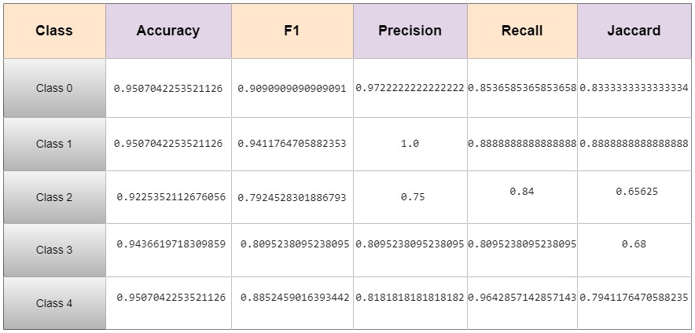

# Kidney Microscopy Image Grading with Deep Learning
A deep learning architecture using SE_resnet14 algorithm. 
This project implements a deep learning model to automatically grade kidney microscopy images. It helps pathologists diagnose kidney conditions more efficiently by classifying images into different severity levels. The goal is to enhance the accuracy and speed of pathology assessments through AI.

Features
- Automatically classify kidney biopsy images.
- hybrid deep learning model for high accuracy.
- Web interface for image upload and grading.
- Supports multiple grading systems for various kidney diseases.

## Results

## Future Scope or Planned Features:

- Support for additional grading scales.
- Improved accuracy with a larger dataset.
- Mobile-friendly interface for remote use.
